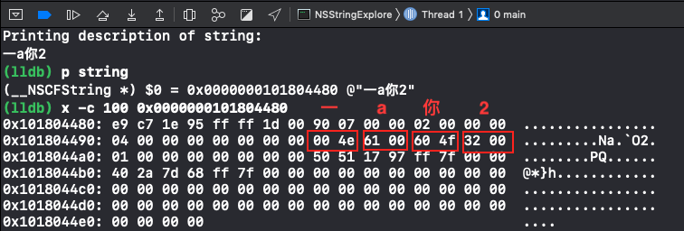
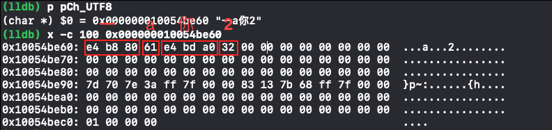
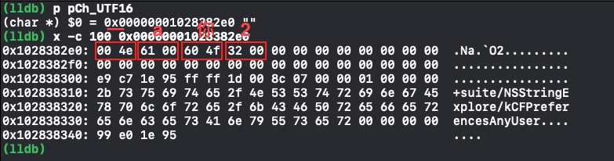

# 2019/01/03  内存映射文件原理（mmap函数）
计算机的内存大小指代RAM（随机存储器），也就是我们常说的内存条，用于数据交换；而磁盘大小用于数据存储。RAM内存一般较小，如4G/8G/16G容量，这是实打实的，4G内存寻址可以从 0x0000 0000 ~ 0xFFFF FFFF，CPU 直接对内存操作速度也是极快，但是随着计算机的发展，加载一个大型应用程序————即把二进制执行文件载入到内存中执行，4G内存已经无法满足了，这时候除了一味地增加内存条大小，还有其他选择吗？

这时候引入了虚拟内存，也称逻辑内存。在Window中称之为”虚拟内存“；Linux中称之为”Swap交换区“。应用程序操作的都是虚拟内存，比如一个程序需要2G的内存，那么地址从0x0 ~ 0x7FFF FFFF，实际对应的物理内存可能是从0x0001000偏移，这个映射关系由 MMU (Memory Management Unit)单元操作。

再进一步说，如果一个应用程序要占1G的内存，但是实际可用的物理内存仅512M，显然能够加载最多一半到内存中，还有一般数据只能临时存储到磁盘中，等需要用到的时候再从磁盘中加载到内存，而内存不常用的数据则会被释放掉。对于这种I/O磁盘读取是比较耗性能和时间，所以显然不可能大块大块的交换，为此引入了”页“的概念，一般以4K为单元。

最后说下今天学习的内存映射文件原理，这个概念是在今天校对[Streaming multipart requests](http://khanlou.com/2018/11/streaming-multipart-requests/)中谈及作者的网络库处理 multipart 文件上传实现中，由于一次性加载大文件到内存中导致程序会崩溃，最后都采用了mmap方式解决这个问题。

首先我的理解（未考证），系统内存8G也好，16G也罢，单个应用程序是不可能独享的，自身就已经加载了内核/操作系统，以及其他一些服务程序还有应用程序，所以使用内存是有限的；

内存映射文件通常是指和磁盘中存储的文件进行关联，以某种方式建议映射关系————这也是mmap()函数干的事情，应用程序进程地址其实就是逻辑地址/虚拟地址，此时调用mmap函数，那么在逻辑空间中会指定一块大小和磁盘文件大小一致的区域，这都是**虚的**，仅仅是一个描述罢了。这种对应关系纯粹是逻辑上的概念。此时并未将磁盘上的文件读入内存，但是创建了一个描述对象（`struct address_space`），虚拟内存现在知道自己指向了磁盘的哪个文件（mmap创建的时候，会传入file handle描述对象）。

一旦应用程序使用逻辑地址去读取磁盘内容时，MMU 要将逻辑地址转成物理内存地址去读取，但是一开始是没有进行读取文件到内存操作，所以MMU在地址映射表中无法找到逻辑地址对应的物理内存地址，会产生一个缺页终端，缺页中断响应函数会在交换区中寻找对应的页面，找不到则会从磁盘读取文件到物理内存中，找到了则直接使用。

乍一看貌似和直接I/O读取到内存没有两样，但是有一点忽略了，虚拟内存地址以页为单位加载，在拷贝过程中，发现物理内存不够用，则会通过虚拟内存地址将暂时不用的物理页面交换到磁盘中。并非是一次性加载。

另外我看了一些文章说到，从磁盘读取文件，是文件操作系统的工作，它使用read函数copy一份磁盘上的内容到内核空间的一个缓冲区，然后再将这些数据copy到用户控件，产生了2次copy行为，也就是说物理内存中会有两份数据；而mmap调用时并未进行数据拷贝，只有在真正读取时产生缺页终端处理中才会将文件直接映射到用户空间（也就是物理内存中）。


# 2019/01/04  CocoaLumberjack 日志库框架学习

CocoaLumberjack 日志库地址：[点击前往](https://github.com/CocoaLumberjack/CocoaLumberjack)


设计思路：

1. 作为一个日志库，输出日志接口不外乎两种：一、函数调用，例如`NSLog()`；二、定义一个日志管理类（通常来说是个单例），开放一个方法作为日志输出接口；另外还可以在两者基础上封装一层，比如：
  ```oc
  #ifdef DEBUG
    // 实现1
    #define DEBUG_Log(fmt, ...)     NSLog(fmt,##__VA_ARGS__)
    // 实现2
    #define Another_Log(fmt, ...)   [DDLog logWithFormat:(frmt), ## __VA_ARGS__]
  #endif
  ```

2. 实现方式二，我们还可以加入日志等级，比如Error、Warinig、Info、Debug等，另外对日志输出方式可进一步控制，比如过程式同步输出，还是异步输出————不阻塞线程；但是却无法满足某些场景需求，比如我们更希望某条日志希望有多种方式的输出，这才有了后面面向接口的设计；
3. 正如上面的UML图所示，DDLog不再作为一个日志输出工具，而是一个日志输出管理者，允许遵循`DDLogger`接口的日志对象注册进来，为此默认实现了一个 DDAbstractLogger 抽象基类，提供一些基础服务配置，而 DDTTYLogger、DDASLLogger等就是实现类，为了提高可配置型，又搞了一个 DDLogFormatter 接口，用于格式化日志信息。
4. CocoaLumberjack 提供的调用定义如下，最终使用的为`DDLogError`和`DDLogWarn`几个宏：
  ```c
  #define LOG_MACRO(isAsynchronous, lvl, flg, ctx, atag, fnct, frmt, ...) \
        [DDLog log : isAsynchronous                                     \
             level : lvl                                                \
              flag : flg                                                \
           context : ctx                                                \
              file : __FILE__                                           \
          function : fnct                                               \
              line : __LINE__                                           \
               tag : atag                                               \
            format : (frmt), ## __VA_ARGS__]
  
  #define LOG_MAYBE(async, lvl, flg, ctx, fnct, frmt, ...)                       \
        do { if(lvl & flg) LOG_MACRO(async, lvl, flg, ctx, nil, fnct, frmt, ##__VA_ARGS__); } while(0)
  
  #define LOG_OBJC_MAYBE(async, lvl, flg, ctx, frmt, ...) \
        LOG_MAYBE(async, lvl, flg, ctx, __PRETTY_FUNCTION__, frmt, ## __VA_ARGS__)
  
  #define DDLogError(frmt, ...)   LOG_OBJC_MAYBE(LOG_ASYNC_ERROR,   LOG_LEVEL_DEF, LOG_FLAG_ERROR,   0, frmt, ##__VA_ARGS__)
  #define DDLogWarn(frmt, ...)    LOG_OBJC_MAYBE(LOG_ASYNC_WARN,    LOG_LEVEL_DEF, LOG_FLAG_WARN,    0, frmt, ##__VA_ARGS__)
  #define DDLogInfo(frmt, ...)    LOG_OBJC_MAYBE(LOG_ASYNC_INFO,    LOG_LEVEL_DEF, LOG_FLAG_INFO,    0, frmt, ##__VA_ARGS__)
  #define DDLogDebug(frmt, ...)   LOG_OBJC_MAYBE(LOG_ASYNC_DEBUG,   LOG_LEVEL_DEF, LOG_FLAG_DEBUG,   0, frmt, ##__VA_ARGS__)
  #define DDLogVerbose(frmt, ...) LOG_OBJC_MAYBE(LOG_ASYNC_VERBOSE, LOG_LEVEL_DEF, LOG_FLAG_VERBOSE, 0, frmt, ##__VA_ARGS__)
  ```
5. `DDLog` 内部的log实现值得借鉴学习，首先传入的信息都会被封装成一个 `DDLogMessage` 对象，这是的疑惑点是性能文件，毕竟每一次日志输出都在实例化对象，`queueLogMessage` 并非想象地直接`NSLog`打印日志信息这么简单，内部创建了一个队列`_loggingQueue`专门负责日志输出工作，每一次输出日志的操作（block代码块）都会加入到队列中等待被执行，但是某些极端情况，比如不小心陷入了巨大的循环，那么队列中被加入了大量的操作，使用gcd派发这些block代码块，可能会创建非常多的线程最终导致崩溃，因此，DDLog采用了信号量 semaphore 方法，设定了1000最大值：
  ```oc
  dispatch_block_t logBlock = ^{
      dispatch_semaphore_wait(_queueSemaphore, DISPATCH_TIME_FOREVER);
      // We're now sure we won't overflow the queue.
      // It is time to queue our log message.
      @autoreleasepool {
          [self lt_log:logMessage];
      }
  };
  ```
  一旦信号量 `_queueSemaphore` 值小于等于0时会陷入等待，这样就避免了可能创建超多线程的问题

6. `lt_log` 还用到了gcd的group来处理，由于我们的logger可能会是多个，所以需要遍历，然后调用每个 logger 的 `logMessage` 方法：

  ```
  for (DDLoggerNode *loggerNode in self._loggers) {
      // skip the loggers that shouldn't write this message based on the log level
  
      if (!(logMessage->_flag & loggerNode->_level)) {
          continue;
      }
      
      dispatch_group_async(_loggingGroup, loggerNode->_loggerQueue, ^{ @autoreleasepool {
          [loggerNode->_logger logMessage:logMessage];
      } });
  }
  dispatch_group_wait(_loggingGroup, DISPATCH_TIME_FOREVER);
  ```
  这么做的好处每一条信息只有被所有logger输出过，才会进行下一条日志。


> 总结：面向接口编程的实战项目，值得学习；另外gcd的使用，semaphore信号量，gcd group等


# 2019/01/07(Universal type 和 existential type的区别)
[Universal type 和 existential type的区别](https://stackoverflow.com/questions/292274/what-is-an-existential-type)

When someone defines a universal type ∀X they're saying: You can plug in whatever type you want, I don't need to know anything about the type to do my job, I'll only refer to it opaquely as X.

When someone defines an existential type ∃X they're saying: I'll use whatever type I want here; you wont know anything about the type, so you can only refer to it opaquely as X.

Universal types let you write things like:

```java
void copy<T>(List<T> source, List<T> dest) {
   ...
}
```
The copy function has no idea what T will actually be, but it doesn't need to.

Existential types would let you write things like:

```java
interface VirtualMachine<B> {
   B compile(String source);
   void run(B bytecode);
}

// Now, if you had a list of VMs you wanted to run on the same input:
void runAllCompilers(List<∃B:VirtualMachine<B>> vms, String source) {
   for (∃B:VirtualMachine<B> vm : vms) {
      B bytecode = vm.compile(source);
      vm.run(bytecode);
   }
}
```

Each virtual machine implementation in the list can have a different bytecode type. The runAllCompilers function has no idea what the bytecode type is, but it doesn't need to; all it does is relay the bytecode from VirtualMachine.compile to VirtualMachine.run.

Java type wildcards `(ex: List<?>)` are a very limited form of existential types.

> Update: Forgot to mention that you can sort of simulate existential types with universal types. First, wrap your universal type to hide the type parameter. Second, invert control (this effectively swaps the "you" and "I" part in the definitions above, which is the primary difference between existentials and universals).

```java
// A wrapper that hides the type parameter 'B'
interface VMWrapper {
   void unwrap(VMHandler handler);
}

// A callback (control inversion)
interface VMHandler {
   <B> void handle(VirtualMachine<B> vm);
}
```

Now we can have the VMWrapper call our own VMHandler which has a universally typed handle function. The net effect is the same, our code has to treat B as opaque.

```java
void runWithAll(List<VMWrapper> vms, final String input)
{
   for (VMWrapper vm : vms) {
      vm.unwrap(new VMHandler() {
         public <B> void handle(VirtualMachine<B> vm) {
            B bytecode = vm.compile(input);
            vm.run(bytecode);
         }
      });
   }
}
```

An example VM implementation:


```java
class MyVM implements VirtualMachine<byte[]>, VMWrapper {
   public byte[] compile(String input) {
      return null; // TODO: somehow compile the input
   }
   public void run(byte[] bytecode) {
      // TODO: Somehow evaluate 'bytecode'
   }
   public void unwrap(VMHandler handler) {
      handler.handle(this);
   }
}
```

# 2019/01/12 (NSString 探究)

关于编码知识：Unicode字符集、UTF8、UTF16、UTF32编码、大小端等知识点，更多可以看我的[字符集编码演变史](https://www.jianshu.com/p/9ee21d13144e)，是入门科普文，自认为还不错。

为何探究NSString？我司代码中使用c++自定义了CEQString8 CEQString16等类型，可以和NSString互转，可能对c++有抵触吧，所以就没细看实现。但今日遇到某个问题需要了解下实现，在c++代码实现中发现其实也不过是编码转换，自定义类用一个char数组存储了unicode码通过utf8编码后的数据。

接着我写了个Demo简单探究了下NSString的数据结构：

```objective-c
// ======================================================================================================
// Demo 涉及到的四个 Unicode 字符
// \u{4e00} 对应中文“一”  utf8 {e4 b8 80} utf16 {4e00}
// \u{4f60} 对应中文“你”  utf8 {e4 bD a0} utf16 {4f60}
// \u{0061} 对应字母“a”   utf8 {61} utf16 {0061}
// \u{0032} 对应数字“2”   utf8 {32} utf16 {0032}
// ======================================================================================================
// Unicode 段划分        UTF8 编码                                有效编码位
// 0x0 ~ 0x7F           0XXXXXXX                                    7
// 0x80 ~ 0x7FF         110XXXXX 10XXXXXX                           11
// 0x800 ~ 0xFFFF       1110XXXX 10XXXXXX 10XXXXXX                  16
// 0x10000 ~ 0x10FFFF   11110XXX 10XXXXXX 10XXXXXX 10XXXXXX         21
// =======================================================================================================
// Unicode 段划分        UTF16 编码                                有效编码位             备注
// 0x0 ~ 0xFFFF         XXXXXXXX XXXXXXXX                          2 字节     Unicode中去除了0xD800~0xDFFF区间
// 0x100000 ~ 0x10FFFF  (0xD800 ~ 0xDBFF) (0xDC00 ~ 0xDFFF)        4 字节     前者高代理区 后者低代理区
// =======================================================================================================
// Unicode 段划分        UTF32 编码                                有效编码位             备注
// 0x0 ~ 0x10FFFF       XXXXXXXX XXXXXXXX XXXXXXXX XXXXXXXX        4 字节
// =======================================================================================================
NSString *string = [NSString stringWithFormat:@"一a你2"];
NSUInteger length = string.length; // 4个
const char *pCh_UTF8 = [string cStringUsingEncoding:NSUTF8StringEncoding];
const char *pCh_UTF16 = [string cStringUsingEncoding:NSUTF16StringEncoding];
const char *pCh_UTF32 = [string cStringUsingEncoding:NSUTF32StringEncoding];

// length:8    capacity:10    bytes:<e4b88061 e4bda032>
NSData *data_UTF8 = [string dataUsingEncoding:NSUTF8StringEncoding];
// length:10   capacity:12    bytes:<fffe004e 6100604f 3200> 其中ff fe标识大小端
NSData *data_UTF16 = [string dataUsingEncoding:NSUTF16StringEncoding];
// length:20   capacity:25    bytes:<fffe0000 004e0000 61000000 604f0000 32000000>
NSData *data_UTF32 = [string dataUsingEncoding:NSUTF32StringEncoding];
```
下面的图都是查看了内存内容，首先是`NSString`实例的内存：



UTF8 编码后字符指针指向的内存：



UTF16 编码后字符指针指向的内存：



UTF32 编码后字符指针指向的内存：

